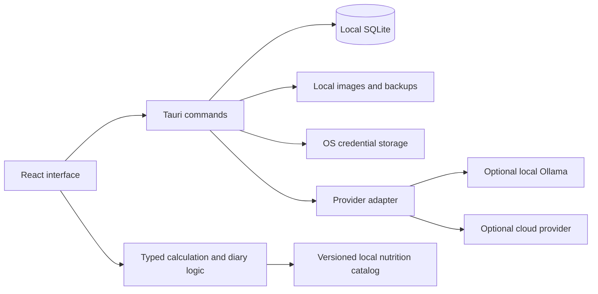

# CalPal design

Status: milestone 1 foundation implemented; later features remain proposed. Date: 2026-09-30.

This document describes the complete intended product. The Windows offline diary foundation is implemented in milestone 1; the roadmap identifies the remaining work. AI model selection remains provisional.

## 1. Product intent

Build a personal nutrition tracker that makes logging a meal easier than skipping it. Bring together the useful calorie-tracking, body-metric, and recipe features of MyFitnessPal with the photo and natural-language entry approach of Cal AI.

The personal version is free to use, with no feature paywalls, advertisements, subscriptions, social feed, or compulsory account. Use original branding, UI, code, and permitted food data. Inspiration from other apps defines feature goals rather than a requirement to reproduce their assets or databases.

### Principles

- Start on today's diary, ready to log.
- Put the common action one click or tap away.
- Allow a useful first entry without onboarding or AI setup.
- Keep detailed nutrition and settings available through progressive disclosure.
- Make every AI assumption easy to correct.
- Keep the core useful offline and independent of a provider's pricing.
- Preserve historical records when goals, foods, recipes, or providers change.

### Scope

| Personal version | Later possibilities | Outside the first release |
| --- | --- | --- |
| Diary, daily totals, calorie target calculator | Barcode scanning and label OCR | Social feeds and competitions |
| Weight and other metric history | Phone app and optional sync | Coaching marketplace |
| Recipes, custom foods, reusable meals | Health-platform integrations | Mandatory subscriptions |
| Photo and text AI meal estimates | Adaptive target suggestions | Clinical diet prescriptions |
| Local export and restore | Public distribution or monetization | Automatic diet changes by AI |

## 2. Platform and installation

**Selected platform: Windows desktop first.** The owner explicitly confirmed Windows desktop installation when authorizing milestone 1. Mobile options below are future alternatives.

| Option | Installation | Design implication |
| --- | --- | --- |
| Windows desktop | Tauri-generated setup executable; MSI optional | Straightforward access to a local model and SQLite |
| Android first | Signed APK for personal sideloading | Strong camera flow; choose mobile shell and AI location before coding |
| iPhone first | Development or TestFlight/App Store distribution | Apple tooling, signing, and distribution requirements need a separate plan |
| Installable web app | Browser installation where supported | Convenient access, but not equivalent to a native installer or desktop storage |

The foundation uses **Tauri 2 + React + TypeScript + SQLite**. The initial packaging target is a per-user Windows setup executable generated with NSIS. Tauri also supports MSI packages. See [Tauri Windows installer documentation](https://v2.tauri.app/distribute/windows-installer/).

Application installation must not depend on AI installation. Manual features work immediately. Local AI setup is a separate optional step with clear model-download size, hardware needs, and readiness state. Do not silently install models or create a cloud account.

For personal Windows distribution, start with a per-user installer. Account for WebView2 availability; test an actual clean install and upgrade. Code signing and automatic updates are later distribution decisions. An unsigned personal installer may encounter Windows trust prompts; do not promise a warning-free installation. Reinstalling, upgrading, or uninstalling must not silently destroy personal records.

## 3. Navigation and visual design

Use three primary destinations: **Today**, **Recipes**, and **Progress**. Keep settings behind a small, labeled settings action. The global **Add food** action opens the same compact composer from any destination.

### Today

Show the selected date, consumed calories, target, and remaining calories first. Use one restrained progress indicator and text totals. Optional macro totals sit below. The diary is grouped into Breakfast, Lunch, Dinner, and Snacks with editable grouping labels later.

Below the summary, show meal entries and a prominent Add food action. Recent foods, favorites, and saved meals reduce repeat entry. Weight and water shortcuts can be enabled without turning the page into a dashboard of unrelated cards.

```text
Today                         < date >     Settings

1,420 eaten     2,100 target     680 remaining
[--------------------- calorie progress ----------]
Protein 92 g       Carbs 160 g       Fat 48 g

[ Add food ]                  [ Log weight ]

Breakfast                                      420
  Oats with yogurt                   1 serving  Edit
Lunch                                          610
  Chicken rice bowl                  1 serving  Edit
Dinner                                         390
  Vegetable soup                     2 cups     Edit
Snacks                                           0

Today                  Recipes                Progress
```

Numbers above are illustrative layout content, not measured nutrition data.

### Add food composer

Three plainly labeled entry choices: **Search / manual**, **Describe**, and **Photo**. All produce the same reviewable food rows. The composer remembers the selected diary date and meal section.

The review step shows item names, portions, calories, and a simple estimate indicator. Expand a row to see nutrients, source, and assumptions. Primary action: **Save to diary**. Secondary actions: edit portion, add item, remove item, or save as a reusable meal.

### Visual direction

Use a neutral background, clear typography, generous spacing, and one muted accent color. Favor flat sections and quiet dividers. Avoid dense dashboards, competing cards, animations that delay entry, and punitive red states for exceeding a target. The foundation uses a pale gray-green canvas (#f6f8f7), white surface, dark green-gray text (#20332f), and muted pine accent (#35685f), with a matching dark theme. Bahnschrift headings and Segoe UI body text use local Windows fonts. The app icon combines a C with the add-entry mark.

Support keyboard entry, visible focus, screen-reader names, readable contrast, text scaling, and sufficiently large pointer/touch targets. Charts need numerical summaries. Color must never be the only indication of a state. Light and dark themes should share the same layout.

### Friction targets

- Open the app directly to Today after initial setup.
- Log a recent food with the default portion in at most three actions from Today.
- Save a quick calorie-only entry without entering macros.
- Make date, meal, and portion editable in the composer without opening settings.
- Show a compact Undo after deletion; reserve confirmation for bulk destruction.
- Treat notifications and reminders as opt-in, off by default.

These are acceptance targets to test, not claims about an existing app.

## 4. Food diary and daily calculations

Each diary entry records an explicit diary date, meal group, item, portion, energy, optional macros, and nutrition provenance. Support manual kcal entry, custom foods, local food search, recent/favorite foods, saved meals, and recipe servings.

Users can edit, delete, copy to another date, or backdate entries. A save must be transactional and idempotent so repeated button presses cannot create duplicates. Show completed records immediately after durable local storage succeeds.

### Calculation rules

- **Consumed kcal** = sum of non-deleted diary entries for the selected diary date.
- **Daily target** = the effective target stored for that date, including an explicit override if present.
- **Remaining kcal** = daily target minus consumed kcal. Preserve negative values and display neutral wording such as “120 over target.”
- **Macros** = sum of known values. Missing nutrients remain unknown; mark totals as partial instead of treating missing values as zero.
- **Weekly average** = sum divided by included days, with coverage shown. Missing diary days are not automatically complete zero-intake days.
- A “Day complete” action distinguishes an intentionally complete diary from partial or missing logging.

Use stored food energy when available. A `4 × protein + 4 × carbohydrate + 9 × fat` energy fallback is a simplified approximation, used only when energy is absent and the required macros are known; label it derived. It may differ from label energy because of rounding, fiber, alcohol, or other components. Do not overwrite a source's stated kcal to force macro agreement.

Store canonical grams, milliliters where applicable, centimeters, kilograms, and kcal. Accept familiar serving units with documented conversions. Never equate milliliters with grams unless food-specific density is known. Keep full calculation precision internally; round displayed kcal to whole numbers and displayed macros consistently.

Diary dates are local calendar dates selected at logging time. Store event timestamps in UTC and timezone metadata separately. A timezone change must not silently move past diary entries between dates.

## 5. Daily calorie target calculator

Offer either a **manual daily target** or an **estimated target**. Manual entry is sufficient to start logging and requires no demographic information.

For the initial adult estimation route, use the simplified Mifflin–St Jeor resting energy equation:

```text
Estimated resting kcal/day = 10 × weight_kg + 6.25 × height_cm
                            − 5 × age_years + coefficient

Equation coefficient: +5 for the study's male formula;
                      −161 for the study's female formula.
Estimated maintenance = estimated resting kcal/day × activity multiplier.
Daily target = estimated maintenance + chosen signed kcal adjustment.
```

The original study supplies these resting-energy equations; it does not establish the activity choices or adjustments used by this app. See [Mifflin et al., 1990](https://pubmed.ncbi.nlm.nih.gov/2305711/?dopt=Abstract).

Provisional app activity presets are 1.2, 1.375, 1.55, 1.725, and 1.9, with plain descriptions and an editable advanced value. These are heuristic starting assumptions, not measured expenditure. The UI should call the result an estimate and explain the inputs.

Use age rather than requiring a full birth date. Explain why the equation variant is requested, allow it to be skipped, and route skipped/inapplicable inputs to a manual target. The automated calculator is scoped to adults; manual tracking remains available when the equation is inappropriate.

Maintenance uses no adjustment. Loss and gain modes allow a user-chosen adjustment; do not assert an exact weight-change date or automatically impose an aggressive deficit. Detailed dietary advice is outside scope.

Changing profile data can produce a proposed new target. It does not silently change the active target. Apply accepted target changes from a chosen effective date and preserve historical target snapshots. The first version does not automatically adapt targets from short-term weight fluctuations.

Exercise is optional and informational in the first release. Do not add exercise calories back by default because the activity estimate already accounts for activity. Any future add-back policy needs an explicit setting and an explanation of overlap.

## 6. Weight and other metrics

Support weight, waist and other named body measurements, body-fat percentage entered by the user, and water intake. Optional custom numeric metrics can follow the standard metric model.

Record value, unit, date/time, and optional note. Multiple measurements on one day are allowed and editable. Weight charts use the last measurement per day for the daily series, show individual points on request, and show a seven-day mean of available daily values with sample coverage. Do not fabricate measurements for missing days.

Provide period selection, absolute change, and a simple trend summary. Preserve raw values on unit changes; convert presentation only. Weight goals are separate from calorie-target history. Do not infer body-fat percentage from photos or imply that a recorded metric was medically measured.

## 7. Recipes and reusable meals

A recipe has a name, optional instructions, ingredient rows, and a yield. Each ingredient references a nutrition snapshot and a mass or known serving conversion.

```text
Ingredient kcal = grams used × ingredient kcal per 100 g / 100
Recipe kcal = sum of ingredient kcal
Kcal per serving = recipe kcal / positive serving count
Kcal for weighed portion = recipe kcal × portion_g / measured finished_yield_g
```

Support yield as either a serving count or a measured finished weight, with both allowed when supplied. Cooking changes water weight, so raw ingredient mass must not substitute for measured cooked yield. Oil, sauces, and additions need explicit ingredient entries. Mixed raw/cooked food records must be visibly identified.

For example, an illustrative 1,600 kcal recipe yielding four servings gives 400 kcal per serving. If the finished recipe weighs 800 g, a 150 g portion gives 300 kcal. The source ingredient values determine real results.

Recipe editing creates a new version. Previously logged portions retain their original nutrition snapshot. Recipe macros follow the same missing-value rules as diary entries. Warn about unresolved ingredient amounts before claiming complete recipe totals.

Reusable meals are bundles of foods or recipe portions with a name, intended for repeat logging. Copying a meal creates independent diary entries; editing the saved meal does not rewrite previous days.

## 8. AI photo and description estimates

AI is a shortcut into the diary. It proposes food identities, amounts, and assumptions. Deterministic code calculates nutrition from matched food records whenever possible. Every result is a draft until the user saves it.

### Photo flow

1. Choose or drag in a photo; camera capture is an optional later platform feature.
2. Optionally add context such as “half the bowl” or “cooked with one tablespoon of oil.”
3. Prepare a resized image and strip location metadata before any upload.
4. Ask a vision-capable provider for structured food candidates and portion assumptions.
5. Match candidates to local/cached nutrition records and calculate draft totals.
6. Show editable rows, a plausible estimate range when available, and important assumptions.
7. Save the reviewed draft to the selected diary date and meal.

### Description flow

Example: “Two eggs, two slices of toast with butter, and coffee with milk.” Parse separate items and preserve supplied units. Reuse known portion conversions where possible. Show assumed butter and milk amounts rather than hiding them. Ask one compact clarification when the missing amount materially affects the result; otherwise make the assumption visible and editable.

### Estimate quality

A single image cannot reliably reveal exact mass, hidden oil, ingredients, or preparation method. Exact weighed and labeled entries should remain the most direct route for precision. Label photo-derived values as estimates.

Use evidence labels such as **label/manual**, **database with known portion**, and **AI with assumed portion**. Do not invent percentage accuracy or treat model-reported confidence as calibrated certainty. An AI-generated interval is also an estimate, not a validated statistical confidence interval.

The reviewed estimate may be logged even when no database match exists, provided the row is clearly marked AI-only. Preserve its assumptions and unknown nutrients. Never fabricate a food-database identifier or present missing macros as zero.

### Provider strategy

| Route | Role | Constraints |
| --- | --- | --- |
| Local Ollama + suitable vision model | Preferred candidate for avoiding per-request charges | Separate setup, model download, hardware and speed evaluation |
| Hosted free tier | Optional convenience if one fits | Quotas, availability, terms, and pricing can change |
| Xiaomi MiMo | Optional hosted candidate to evaluate | Verify the selected model's image support, terms, cost, and regional access |
| OpenAI API | Optional hosted alternative | User-supplied key, explicit enablement, provider usage charges |
| Manual entry and local food search | Always available | More user input; no AI dependency |

[Ollama's vision documentation](https://docs.ollama.com/capabilities/vision) confirms image-and-text input. [Its structured-output documentation](https://docs.ollama.com/capabilities/structured-outputs) supports response schemas; client validation is still required. [Qwen3-VL](https://ollama.com/library/qwen3-vl) is one local candidate to benchmark, not a locked dependency or a claim of calorie accuracy.

Xiaomi has documented multimodal models in its [MiMo announcements](https://mimo.mi.com/docs/en-US/news/latest/v2-omni-release). Its [MiMo-V2-Pro announcement](https://mimo.xiaomi.com/mimo-v2-pro) also describes paid API pricing and a limited promotional free-access period. That is evidence against assuming Xiaomi API access is permanently free; it is not a current price quote for every MiMo model. Recheck the exact model at implementation time.

**Recommended policy:** manual functionality is free and offline; local AI is optional; cloud calls require explicit setup. If local hardware is inadequate, present manual entry and optional hosted choices. Never switch to a paid provider automatically. No AI accounts, models, or billing are configured in this repository setup.

### Adapter contract and failures

Use a provider-neutral input: text, optional prepared image, locale, and optional portion hints. Output: food candidates, structured quantities, assumptions, unresolved questions, and estimate metadata. Providers declare text/vision/structured-output capabilities so incompatible models cannot be selected for photos.

Validate response shape, finite nonnegative nutrition values, unit conversions, portion limits, maximum item count, and request size. Reject unsupported units rather than silently inventing conversions. AI content is untrusted data and cannot issue application commands or write records.

Track request IDs, provider/model, and prompt/schema version. Support cancellation and timeout. Keep the original draft on connection failure, unavailable model, rate limit, or malformed response. Retry through an explicit action; do not send duplicate billable requests indefinitely. A late response cannot overwrite a newer edit. Saving an AI draft follows the same duplicate prevention as a manual entry.

## 9. Food-data strategy

Start with user-defined foods and a curated local food catalog with portions suitable for ordinary logging. Evaluate an attributable subset of USDA Foundation/SR Legacy/FNDDS data before bundling it; do not download or ship the full branded database by default.

[USDA FoodData Central](https://fdc.nal.usda.gov/api-guide/) publishes public-domain/CC0 nutrition data and requires a key for API access. [Downloadable datasets](https://fdc.nal.usda.gov/download-datasets/) can support the local catalog. Include source attribution and dataset version. This avoids requiring a USDA API key for basic offline use.

Later online search may fetch and cache specific source records. Handle source availability and rate limits gracefully. Canada-specific brands, restaurants, and user favorites may need manual custom foods initially; do not promise global branded-food coverage.

Nutrition records must identify source, source ID where applicable, raw/cooked state, basis quantity, units, energy type, and optional nutrient values. Manual label data remains editable and distinct from imported records. Treat all absent nutrient fields as unknown.

## 10. Proposed technical architecture



The domain module owns deterministic calculations and portable validation. Native commands own durable writes, filesystem access, image preparation, secrets, and external requests. Keep provider keys outside the webview, frontend bundles, and browser storage. For a personal installed app, the native layer may call the user's configured provider directly; no hosted server is needed. A future public service must design its own authentication and secret boundary.

Use SQLite migrations, constrained queries, and transactions. Limit Tauri capabilities to required commands and paths; select compatible plugin versions during scaffolding rather than claiming integration now. Cache local lookups and keep AI work off the UI thread. Evaluate local inference performance on the actual device before promising latency.

### Initial entities

| Entity | Key contents |
| --- | --- |
| Profile | Units, timezone, optional calculator inputs, preferred meal labels |
| GoalVersion | Method, inputs, calorie target, effective date, optional macro goals |
| DiaryDay | Local date, target snapshot, completion state |
| FoodRecord | Nutrition basis, portions, source identity/version, custom/imported flag |
| DiaryEntry | Day/meal, portion, nutrient snapshot, origin, optional recipe/AI reference |
| RecipeVersion | Name, ingredients with snapshots, serving count, measured finished yield |
| SavedMeal | Named collection of food/recipe portions |
| MetricEntry | Type, value, canonical unit, measurement timestamp, local date, note |
| EstimateDraft | Request ID, provider/model, version metadata, items, assumptions, review state |
| Attachment | Local image path, retention choice, entry/draft relationship |

Use stable IDs. Logged nutrition and targets are snapshots; imported-source changes must not rewrite history. Keep pending drafts separate from diary totals. Store secret references only, never secret values in SQLite.

## 11. Privacy, backup, and operating cost

The default app stores records on the device and makes no AI request until AI is configured and invoked. No analytics or telemetry by default. Cloud mode sends the selected meal content and minimum context; body history is not needed for identifying a meal. Show which provider will receive content when cloud mode is enabled.

Temporary image copies are removed after processing. Original photos are not retained by default; users may opt to attach them locally. Cloud-provider retention policies are separate and must be explained during setup. Local storage is not automatically encrypted; an encrypted backup/database is a separate feature choice rather than an unsupported privacy claim.

Use OS credential storage for provider keys. Exclude keys from logs, Git, screenshots used for diagnostics, and exports. Do not bundle a developer's shared secret. Restrict provider endpoints to configured destinations; loopback is allowed for local AI, and remote traffic should use HTTPS.

Provide CSV exports for diary and metrics, plus a versioned complete backup containing profile, records, recipes, and optional attachments. Restoration must validate format, preview the impact, back up current data, and apply atomically. The first version restores by explicit replacement, not an undocumented merge. Invalid or incompatible backups leave current records intact.

The app has no mandatory hosting bill in the proposed personal architecture. Local inference still uses storage, compute, and electricity; no per-request API charge does not mean no resource cost. Food data, AI models, certificates, store distribution, and hosted APIs have separate terms or potential costs. Future monetization is deferred and should not complicate the personal build.

## 12. Validation and success criteria

The personal release is successful when the owner can install it, log typical meals quickly, understand the daily total, record weight, reuse a recipe, and correct a photo or text estimate without losing data.

Validate deterministic arithmetic, serving conversions, missing nutrients, raw/cooked distinctions, history snapshots, date/time boundaries, duplicate prevention, and backup restoration. Test AI schema/failure handling with fixtures and separately evaluate real providers on a small set of meals with known portions and labels. Report portion and energy errors with denominators and failure counts; no unsupported accuracy percentage.

Check offline logging, persistence after restart, keyboard access, text scaling, and installer upgrades with existing records. Runtime and installer verification begin only after implementation. See the [roadmap](ROADMAP.md) for milestone-specific completion criteria.

## 13. Decisions to resolve before implementation

1. First platform resolved: Windows desktop installer, confirmed for milestone 1.
2. Local AI suitability: device RAM/GPU, acceptable download size, and acceptable processing time.
3. Whether hosted AI should be available initially, and which provider/model to benchmark.
4. Preferred units, meal groups, metrics, and initial food-catalog coverage.
5. Exact visual palette and whether to retain optional meal photos.

The owner authorized milestone 1 and confirmed Windows desktop. Remaining decisions can use the defaults in this proposal and stay editable. Later milestones require separate requests; this implementation stops at the offline foundation.
